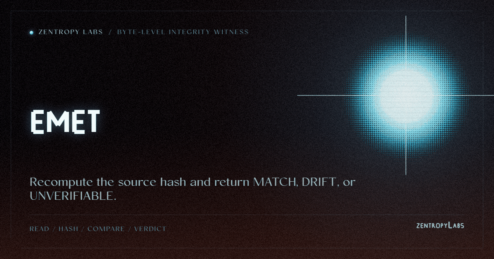

<p align="center"></p>

**Byte-level integrity witness. Four independent implementations, one verdict lattice.**

[](https://pypi.org/project/emet/)
[](LICENSE)
[](https://pypi.org/project/emet/)
[](https://github.com/HarperZ9/emet/actions/workflows/conformance.yml)


EMET checks whether the bytes reaching a model, a reviewer, or a pipeline still
match the source they claim to represent, then emits one of three closed
verdicts: `MATCH`, `DRIFT`, or `UNVERIFIABLE`. Four clean-room implementations,
in stdlib-only Python, Rust, Node.js, and Go, load the same marker corpus and
re-derive it identically against a shared conformance suite. Zero dependencies:
run it straight from a checkout or `pip install emet`.

`emet` is Hebrew for "truth."

## Features

- **Portable witness receipts** (SPEC s.17). Seal any verdict into a
  self-contained, content-addressed JSON receipt; a different party re-verifies
  it offline with `emet check`, zero shared state, zero trust in the producer.
  The same subject and verdict yield a **byte-identical `receipt_id` across
  Python, Rust, and Node.js**, and each implementation verifies the others'
  HMAC signatures. Cross-language parity, including the tampered-receipt
  negatives, is gated in CI.
- **Stripped-credential rebind** (SPEC s.18, experimental). When a re-encode,
  screenshot, or copy strips a C2PA-style embedded credential, the artifact is
  orphaned to embedded-metadata verifiers. EMET anchored the raw bytes out of
  band, so `emet rebind` re-derives the naked bytes' content hash and rebinds
  them to a known anchor: `MATCH` (rebound), `DRIFT` (a claimed identity over
  substituted bytes), or `UNVERIFIABLE` (no known anchor, the honest default).
- **Byte-hash core.** `anchor` pins raw-byte SHA-256 hashes, `verify`
  recomputes them, `coherence` compares a presented view against its source,
  `corroborate` hashes the same file through disjoint read paths to catch a
  tampered read path, not just a broken hash.
- **In-band authority stripping.** `refuse` scans bytes against a versioned
  marker corpus, reports every embedded authority claim by offset, and writes a
  neutralized copy. It reports the claims; it never obeys them.
- **Tamper-evident audit chain.** Every command appends to a hash-chained log;
  `emet audit` recomputes the chain and reports `INTACT` or `BROKEN`.
- **Four implementations, one contract.** A frozen v1.0 spec, a
  language-agnostic conformance suite (44 vectors: 35 core, 5 receipt, 4
  rebind), and clean-room ports in Rust, Node.js, and Go, all scored in CI on
  every push against exactly the capabilities each claims.
- **Machine-readable everywhere.** `--json` on any command emits one
  canonical-JSON envelope; the governed fields are byte-identical across all
  four implementations and the exit code is unchanged.
- **Zero dependencies, by construction.** Stdlib-only Python, no crates, no
  npm packages, no Go modules.

## Usage

```sh
pip install emet
emet selftest        # re-derives the tool's own hash: emet_self_sha256=...
```

Or run it straight from a checkout, no install step at all:

```sh
git clone https://github.com/HarperZ9/emet && cd emet
python membrane.py selftest
```

`emet <cmd>` and `python membrane.py <cmd>` are equivalent. The full command
surface:

```sh
emet anchor  <path>...              # pin raw-byte hashes
emet verify  <path>...              # MATCH / DRIFT / UNVERIFIABLE
emet coherence <source> <view>      # is a presented view faithful to source?
emet refuse  <file>                 # detect + strip in-band authority claims
emet corroborate <path>             # read-path-diverse agreement
emet audit                          # recompute the tamper-evident log chain
emet receipt --from-json <file|->   # portable, content-addressed witness receipt
emet check <receipt.json>           # stateless offline re-verify
emet rebind <naked> --manifest <m>  # rebind stripped bytes (experimental)
emet <any> --json                   # machine-readable canonical envelope
```

Exit codes (SPEC section 5): `0` held · `1` a difference found (DRIFT /
VIEW_DIFFERS_FROM_SOURCE / QUARANTINE / BROKEN) · `2` UNVERIFIABLE · `3`
markers found · `64` usage.

Note: the marker corpus ships separately from the wheel (SPEC s.8), so an
installed `refuse` needs `EMET_CORPUS` set or a source checkout; without it,
the answer is `UNVERIFIABLE reason=E_NO_CORPUS`, never a silent pass.

## Worked example: anchor, verify, let the verdict travel

```sh
$ printf 'hello world\n' > report.md
$ emet anchor report.md
anchored report.md sha256=a948904f2f0f479b8f8197694b30184b0d2ed1c1cd2a1ec0fb85d299a192a447

$ emet verify report.md
MATCH report.md want=a948904f2f0f479b got=a948904f2f0f479b     # exit 0

$ printf 'hello world CHANGED\n' > report.md
$ emet verify report.md
DRIFT report.md want=a948904f2f0f479b got=9fc0ea6515ceadd9     # exit 1
```

Seal the verdict into a receipt and hand it to someone else:

```sh
emet verify report.md --json | emet receipt --from-json - > receipt.json
emet check receipt.json          # on ANY machine: RECEIPT_VALID / TAMPERED / UNVERIFIABLE
```

Add `--recompute-from-paths` to `emet check` to also re-hash the subject bytes
on disk against the recorded digests. For every command with captured real
output, the companion tools (`monitor.py`, `organs.py`), and a runnable demo,
see [USAGE.md](USAGE.md) and [examples/](examples/).

## For developers

The repo ships its own delivery contract; re-check it any time with
`python test_forward_delivery_contract.py`.

Each implementation declares the optional capabilities it does not yet claim
(`EMET_SKIP_CAPABILITIES`), and the runner scores it only on what it does
claim, exactly as CI does:

```sh
git clone https://github.com/HarperZ9/emet && cd emet
python conformance/run.py membrane.py                # Python reference: 44/44

( cd impl/rust && rustc -O emet.rs -o emet )
EMET_SKIP_CAPABILITIES=rebind \
  python conformance/run.py impl/rust/emet           # Rust:    40/40

EMET_SKIP_CAPABILITIES=rebind \
  python conformance/run.py impl/js/emet.js          # Node.js: 40/40

( cd impl/go && go build -o emet emet.go )
EMET_SKIP_CAPABILITIES=receipt,rebind \
  python conformance/run.py impl/go/emet             # Go:      35/35 (core)
```

### Per-implementation capability matrix

| Implementation | Core (35 vectors) | Receipt (5, SPEC s.17) | Rebind (4, SPEC s.18) |
| --- | --- | --- | --- |
| Python (reference) | yes | yes | yes |
| Rust (`impl/rust`) | yes | yes (HMAC hand-composed over its own SHA-256, verified against RFC 4231) | not yet |
| Node.js (`impl/js`) | yes | yes (native `crypto`) | not yet |
| Go (`impl/go`) | yes | not yet ported | not yet |

An unsigned receipt verifies on the content address alone; the HMAC-SHA256
signature is optional and only strengthens integrity when producer and
verifier share a key channel (`EMET_RECEIPT_SIGNING_KEY`). The rebind
cross-language port contract is [docs/REBIND-SPEC.md](docs/REBIND-SPEC.md).

## What it won't do

EMET is an advisory integrity witness: it only reports facts. It can't say `TRUSTED`, doesn't decide whether a model
is safe, runs outside whatever it audits, and never edits, signs, or blocks
anything. Those constraints are the point, not limitations: see
[SPEC.md](SPEC.md) section 6.

## Status

v1.1.0. The spec is **frozen and stable** at 1.0.0. The byte-hash core, the
exit-code split, the `--json` envelope, the marker path, and the audit chain
re-derive across four languages and are checked in CI on every push. What the
1.x line asserts is exactly two things: the **contract is frozen**, and the
**reference implementations are production-grade**. It deliberately does **not** claim
re-derivability is *proven*: all four implementations share an author, and
SPEC section 12's bar, an independent different-author implementation passing
the vectors, is not yet met. For a tool whose only credential is reproduction,
an inflated claim would refute itself, so the claim is scoped to exactly what
CI reproduces today.

## Call for an independent implementation

The highest-leverage contribution is not another language but a
**different-author implementation, written from [SPEC.md](SPEC.md) alone**
(not by reading the existing code), in any language, that passes the core
vectors:

```sh
EMET_SKIP_CAPABILITIES=receipt,rebind \
  python conformance/run.py ./your-emet     # expected: CONFORMANCE 35/35
```

Where your implementation and the spec disagree, **the spec is wrong**: open
an issue; those divergences are the point. Both clean-room ports already did
exactly this. The Node.js port surfaced that the marker occurrence count was
unpinned (now pinned in SPEC section 16 and a dedicated vector), and the Go
port surfaced the reason-code enum and default-JSON-encoder gaps, now pinned;
see [docs/spec-findings-from-go-impl.md](docs/spec-findings-from-go-impl.md).
Claim a language in [Discussions](../../discussions) so effort isn't
duplicated.

## Why it matters

A model-facing view can drift from its source, a monitor can observe the wrong
artifact, and a generated report can overstate what was checked. EMET is the
small external witness for those seams: it re-derives the bytes and reports
what matched, what drifted, and what could not be verified, without ever
becoming an authority. The public value is exactly that: every verdict is a
fact anyone can re-check, same bytes, same answer. It composes with its peer tools
[forum](https://github.com/HarperZ9/forum) (accountable multi-agent
orchestration) and
[accountable-surface](https://github.com/HarperZ9/accountable-surface) (live
perceive/gate/actuate surface), and stands alone just as well.

## Docs

[docs/INTRODUCTION.md](docs/INTRODUCTION.md) (start here) ·
[USAGE.md](USAGE.md) (every command, captured output) ·
[SPEC.md](SPEC.md) (the frozen normative contract) ·
[RATIONALE.md](RATIONALE.md) (why EMET is shaped this way) ·
[conformance/](conformance/) · [THREAT-MODEL.md](THREAT-MODEL.md) ·
[COVERAGE.json](COVERAGE.json) · [SECURITY.md](SECURITY.md) ·
[CONTRIBUTING.md](CONTRIBUTING.md)

MPL-2.0.

## What this believes

This tool is one lane of a family that holds a single belief steady across
every surface: knowledge open to anyone who can attain the means; acceptance
decided by external checks, never reputation; every result re-runnable;
honest nulls first-class; ownership earned by comprehension; learning woven
into the work. The full text lives in [CREDO.md](CREDO.md).
The long form of this belief: [The Unbundling](https://github.com/HarperZ9/flywheel/blob/fix/release-model-identity/docs/essays/2026-07-13-the-unbundling.md).

---

**[Zentropy Labs](https://github.com/ZentropyLabs-ai)** · order out of entropy. An independent lab building evidence-first tools that leave a re-checkable artifact behind. Built by Zain Dana Harper in Seattle. The full workbench is at [Project Telos](https://harperz9.github.io).


---

## The Zentropy Labs ecosystem

This tool is one part of a family that holds a single belief steady across
every surface: knowledge open to anyone who can attain the means; acceptance
decided by external checks, never reputation; every result re-runnable;
honest nulls first-class; ownership earned by comprehension; learning woven
into the work.

- **[Workspace canon](https://github.com/HarperZ9/workspace)**: AGENTS.md, CREDO.md, MISSION.md, ECOSYSTEM.md
- **[Flywheel](https://github.com/HarperZ9/flywheel)**: the one platform (receipts, governance, infra controls, learning loop)
- **[Getting Started](https://github.com/HarperZ9/flywheel/blob/main/GETTING-STARTED.md)**: your first thirty minutes

**[Zentropy Labs](https://github.com/ZentropyLabs-ai)** - order out of entropy. Built by Zain Dana Harper in Seattle.
