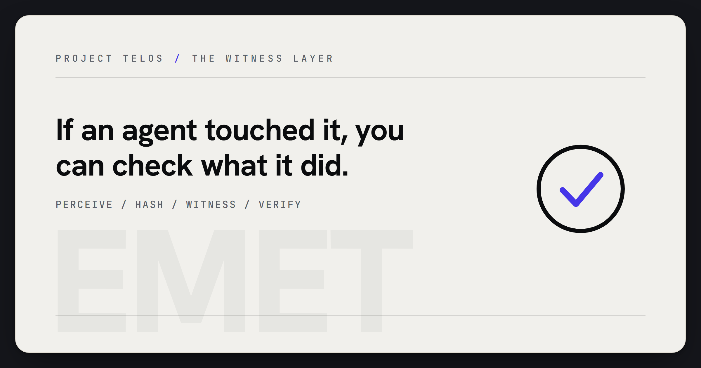

# EMET

> A small external witness for AI oversight: re-derive the bytes, get one of three verdicts, trust nothing in-band.



[](LICENSE)


[](https://pypi.org/project/emet/)
[](https://github.com/HarperZ9/emet/actions/workflows/conformance.yml)

[](https://harperz9.github.io)

EMET is a small external witness for AI oversight and source/view consistency.
It checks whether bytes reaching a model still match the source they claim to
represent, then reports one of three deliberately limited verdicts: `MATCH`,
`DRIFT`, or `UNVERIFIABLE`.

It exists for the gap build-provenance tools do not cover by themselves: a
system vouching for itself in-band, a presented view drifting away from source,
or a monitor reading a different file than the one that actually runs. Trust
comes from re-derivation - same bytes, same answer - not from authority. There
is no `TRUSTED` verdict.

`emet` is Hebrew for "truth."

## Why it matters

EMET is an advisory integrity witness for AI work. Its public value is narrow
and testable: it re-derives bytes, compares source and view material, and emits
closed verdicts without claiming authority, safety, approval, or permission.

That makes it useful anywhere Project Telos needs provenance without another
self-attesting layer. A model-facing view can drift from its source; a monitor
can observe the wrong artifact; a generated report can overstate what was
checked. EMET gives those surfaces a small external witness that says what
matched, what drifted, and what could not be verified.

## Usage

Run the core checks directly from a checkout:

```sh
python membrane.py selftest
python conformance/run.py membrane.py
python test_forward_delivery_contract.py
```

For complete command examples and captured outputs, see [USAGE.md](USAGE.md).

## For developers

Keep EMET small, external, and advisory. Before changing public-facing docs,
conformance behavior, or witness adapters, run the targeted checks:

```sh
python test_forward_delivery_contract.py
python test_membrane.py
python conformance/run.py membrane.py
python -m public_surface_sweeper . --workspace --json
```

Spec changes, conformance-vector changes, and implementation behavior must move
together. EMET must not emit `TRUSTED`, `APPROVED`, `SAFE`, or any value that
grants authority or permission.

## What's here

- A stdlib-only Python reference - `membrane.py` / `organs.py` / `monitor.py` / `corpus.py` / `verdict.py` / `report.py`, no dependencies; run it straight from a checkout or `pip install emet` for the `emet` console script.
- A from-scratch Rust second implementation - `impl/rust/emet.rs`, no crates.
- A clean-room Node.js third implementation - `impl/js/emet.js`, built-in modules only (no npm).
- A clean-room Go fourth implementation - `impl/go/emet.go`, standard library only (no third-party modules).
- A normative, frozen v1.0 spec, a language-agnostic conformance suite, a STRIDE threat model, and an in-toto attestation adapter.
- A versioned marker corpus (`conformance/markers.corpus`) all four implementations load and re-derive identically.
- All four implementations pass the same 35 core conformance vectors in CI on every push - byte-hash core, the exit-code split, the `--json` envelope, the marker path, and the audit chain (write and verify). Five further vectors cover the portable witness receipt (SPEC s.17); Python, Rust, and Node.js pass all 40. The Go implementation passes the 35 core vectors and does not yet implement `receipt`/`check` (see [Receipt support](#receipt-support)). Four further `capability: "rebind"` vectors cover the experimental stripped-credential rebind (SPEC s.18); the Python reference passes them, and cross-language parity is follow-on (`docs/REBIND-SPEC.md`) - a partial impl declares `EMET_SKIP_CAPABILITIES=rebind` and is scored only on what it claims.

## Reproduce it

```sh
git clone https://github.com/HarperZ9/emet && cd emet
python conformance/run.py membrane.py            # Python reference: 40/40
( cd impl/rust && rustc -O emet.rs -o emet )     # build the Rust second implementation
python conformance/run.py impl/rust/emet         # Rust:    40/40
python conformance/run.py impl/js/emet.js        # Node.js: 40/40
( cd impl/go && go build -o emet emet.go )       # build the Go fourth implementation
python conformance/run.py impl/go/emet           # Go:      35/40 (core; receipt/check not yet ported)
```

## Use it

From a checkout with `python membrane.py <cmd>`, or after `pip install emet`
with the `emet` console script - the two are equivalent:

```sh
emet selftest                       # re-derive its own hash (emet_self_sha256=)
emet anchor  <path>...              # pin raw-byte hashes
emet verify  <path>...              # MATCH / DRIFT / UNVERIFIABLE
emet coherence <source> <view>      # is a presented view faithful to source?
emet refuse  <file>                 # detect + strip in-band authority claims
emet corroborate <path>             # read-path-diverse agreement
emet audit                          # recompute the tamper-evident log chain
emet receipt --from-json <file|->   # portable, content-addressed witness receipt (SPEC s.17)
emet check <receipt.json>           # stateless offline re-verify: RECEIPT_VALID / TAMPERED / UNVERIFIABLE
emet rebind <naked> --manifest <m>  # rebind stripped bytes to a known anchor (SPEC s.18, EXPERIMENTAL)
emet <any> --json                   # machine-readable canonical envelope (exit code unchanged)
```

A **witness receipt** lets a verdict travel: `emet verify <path> --json | emet
receipt --from-json -` emits a self-contained, content-addressed JSON object that
a DIFFERENT party re-derives on their own machine with `emet check`, zero shared
state and zero trust in the producer. Add `--recompute-from-paths` to `emet check`
to re-hash the subject bytes on disk against the recorded digests (SPEC s.17).

**Stripped-credential rebind (experimental).** When a C2PA-style embedded
credential is stripped by a re-encode, screenshot, or copy, the artifact is
orphaned to an embedded-credential verifier. EMET never bound to embedded
metadata: it anchors the sha256 of the raw bytes out of band, so `emet rebind`
re-derives the naked bytes' content hash and rebinds them to a known anchor in a
portable rebind manifest, emitting `MATCH` (rebound), `DRIFT` (a claimed identity
with substituted bytes), or `UNVERIFIABLE` (no known anchor - the honest default).
A rebind verdict seals into a witness receipt like any other. See [SPEC.md
section 18](SPEC.md) and the cross-language port spec
[docs/REBIND-SPEC.md](docs/REBIND-SPEC.md).

Exit codes (SPEC section 5): `0` held · `1` a difference found (DRIFT /
VIEW_DIFFERS_FROM_SOURCE / QUARANTINE / BROKEN) · `2` UNVERIFIABLE · `3` markers ·
`64` usage.

For an install/build line, per-command worked examples with expected output, the
companion tools (`monitor.py`, `organs.py`), and a runnable demo, see
[USAGE.md](USAGE.md) and [examples/](examples/).

### Receipt support

The portable witness receipt (SPEC s.17) is content-addressed, so the same
subject/verdict/spec/issued_at yields a **byte-identical `receipt_id` across
implementations** (the per-implementation `witness` block is producer identity and
is excluded from the address, s.17.2). A receipt produced by one implementation
re-verifies unchanged under any other.

| Implementation | `receipt` / `check` | Signature (HMAC-SHA256) |
| --- | --- | --- |
| Python (reference) | yes | native (`hmac`) |
| Rust (`impl/rust`) | yes | hand-composed over its own SHA-256 (no external crate); verified against RFC 4231 |
| Node.js (`impl/js`) | yes | native (`crypto.createHmac`) |
| Go (`impl/go`) | not yet ported | -- |

An unsigned receipt verifies on the content address alone; the signature is
optional and only strengthens integrity when producer and verifier share a key
channel (`EMET_RECEIPT_SIGNING_KEY`). The Go clean-room implementation passes the
35 core conformance vectors; porting `receipt`/`check` to Go is the remaining
parity item.

## Proof-surface use

EMET is the witness point in a proof-surface pipeline:

```text
source bytes -> presented view -> witness verdict -> reviewer handoff
```

Use it when a repo, report, model-facing prompt, or generated view needs a
small external check that the presented material still matches the source it
claims to represent.

Fast reviewer checklist:

- `MATCH` means the checked material re-derived to the expected byte-level
  result.
- `DRIFT` means the presented view or checked bytes changed.
- `UNVERIFIABLE` means the witness cannot make the comparison.
- There is no `TRUSTED` verdict.

This makes EMET useful as a release-readiness and diligence artifact: it can
show what was compared and what verdict was produced without asking the witness
to become an authority.

The optional `adapters/proof_surface_receipt.py` adapter emits compact JSON
witness receipts for proof-index and release-readiness workflows. It lives
outside the EMET core and does not change governed stdout, signing, enforcement,
or actuation boundaries. The adapter only accepts governed verdict tokens as
whole tokens and refuses authority-shaped stdout before it enters a receipt.

Its `bundle <bundle.json>` witness re-derives a content-addressed proof-surface
packet: for every file listed in the `proof-surface-bundle/v0` manifest it
recomputes the sibling file's sha256 and reports `MATCH` (all files re-derive),
`DRIFT` (a recorded digest no longer matches disk), or `UNVERIFIABLE` (a listed
file is missing or the manifest is malformed). It runs entirely inside EMET.

## What it won't do

It only reports facts. It can't say `TRUSTED`, doesn't decide whether a model is
safe, runs outside whatever it audits, and never edits, signs, or blocks anything.
Those constraints are the point, not limitations - see [SPEC.md](SPEC.md) section 6.

## Status

v1.0.0 - the spec is **frozen and stable** (v1.0.0). The byte-hash core, the
exit-code split, the `--json` envelope, the marker path (a single versioned corpus
matched identically across the implementations), and the audit chain (write and
verify) all re-derive across four languages and are checked in CI (35 conformance
vectors, all four implementations). What 1.0.0 asserts is exactly two things: the
**contract is frozen**, and the **reference implementations are production-grade**.
It deliberately does **not** claim re-derivability is *proven* - that is a distinct,
still-open axis, stated plainly rather than papered over:

- The Rust, Node.js, and Go implementations are same-author (two of them clean-room
  from the spec alone), not independent.
- SPEC section 12's actual bar - an *independent, different-author* implementation
  passing the vectors - is not yet met, and per section 12 no party should treat
  re-derivability as proven until it is.

Freezing the contract and demonstrating independent re-derivation are orthogonal;
conflating them would be the exact in-band overclaim EMET's `refuse` strips. For a
tool whose only credential is reproduction, an inflated claim would refute itself -
so the claim is scoped to exactly what CI reproduces today.

## Call for an independent implementation

EMET's only credential is reproduction: same bytes, same verdict. Four
implementations (Python reference + Rust + Node.js + Go) already agree on all 35
conformance vectors in CI - but they all share an author, so that agreement shows
the spec is *implementable* (in four languages, from its text alone), not yet
that it is *independently re-derivable*.

The highest-leverage contribution is therefore not another language but a
**different-author implementation, written from [SPEC.md](SPEC.md) alone** (not by
reading the existing code), in any language, that passes `conformance/vectors.json`:

```sh
# build your implementation, then:
python conformance/run.py ./your-emet     # expected: CONFORMANCE 35/35
```

Where your implementation and the spec disagree, **the spec is wrong** - open an
issue; those divergences are the point. (Both clean-room ports already did exactly
this: the Node.js impl surfaced that the marker *count* was unpinned - SPEC section
16 and the `refuse-repeated-marker-occurrence-count` vector now pin it - and the Go
impl surfaced the reason-code enum and default-JSON-encoder gaps, now pinned; see
[docs/spec-findings-from-go-impl.md](docs/spec-findings-from-go-impl.md).) A
different-author implementation is what converts re-derivability from *asserted* to
*demonstrated* (SPEC section 12). Claim a language in [Discussions](../../discussions)
so effort isn't duplicated.

## Docs

[SPEC.md](SPEC.md) · [RATIONALE.md](RATIONALE.md) (why EMET is shaped the way it is, derived from first principles) · [conformance/](conformance/) · [THREAT-MODEL.md](THREAT-MODEL.md) · [COVERAGE.json](COVERAGE.json) · [SECURITY.md](SECURITY.md) · [CONTRIBUTING.md](CONTRIBUTING.md)

MPL-2.0.
